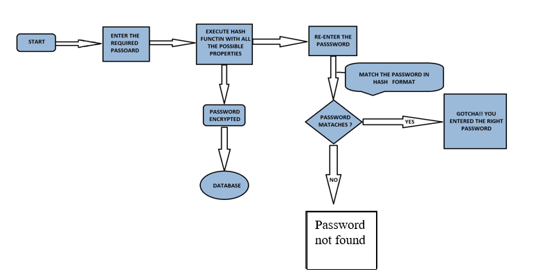

# Passrack-A-Brute-Force-Tool
This is brute force tool based on python IDE which can be used as a multipurpose digital forensic tool to crack digital evidence which is password protected.

# Methodology of making this tool

# Modules Used

Here we use variou modules like:

•	MD5 is based on a hash function that verifies that a file you sent matches the file received by the person you sent it to.

•	SHA stands for secure Hash Algorithm.

•	SHA-1: It was widely used to hash passwords and verify the integrity of files/binaries. It widely used hash function which takes an input and produces a 160-bit (20-byte) hash value known as a message digest.

•	SHA-512: It is an iterated hash function that pads and processes the input message using 1024-bit message blocks. It basically consists of two parts: the message expansion and the state update transformation.

•	SHA-256: It generates an almost-unique 256-bit (32-byte) signature for a text.SHA-256 is used for secure password hashing. if someone could “decrypt” SHA-256 hashes, that is a hash generate some text that would produce the desired hash. It is unlikely that they could use that to send fake messages because most such text to match hashes wouldn’t be reasonable messages.

•	SHA-384: It is roughly 50% faster than SHA-224 and SHA-256 on 64-bit machines, even if its digest is longer. The speed-up is due to the internal computation being performed with 64-bit words, whereas the other two hash functions employ 32-bit words.

In the above image, we cracked a ZIP file password using our password dictionary.
